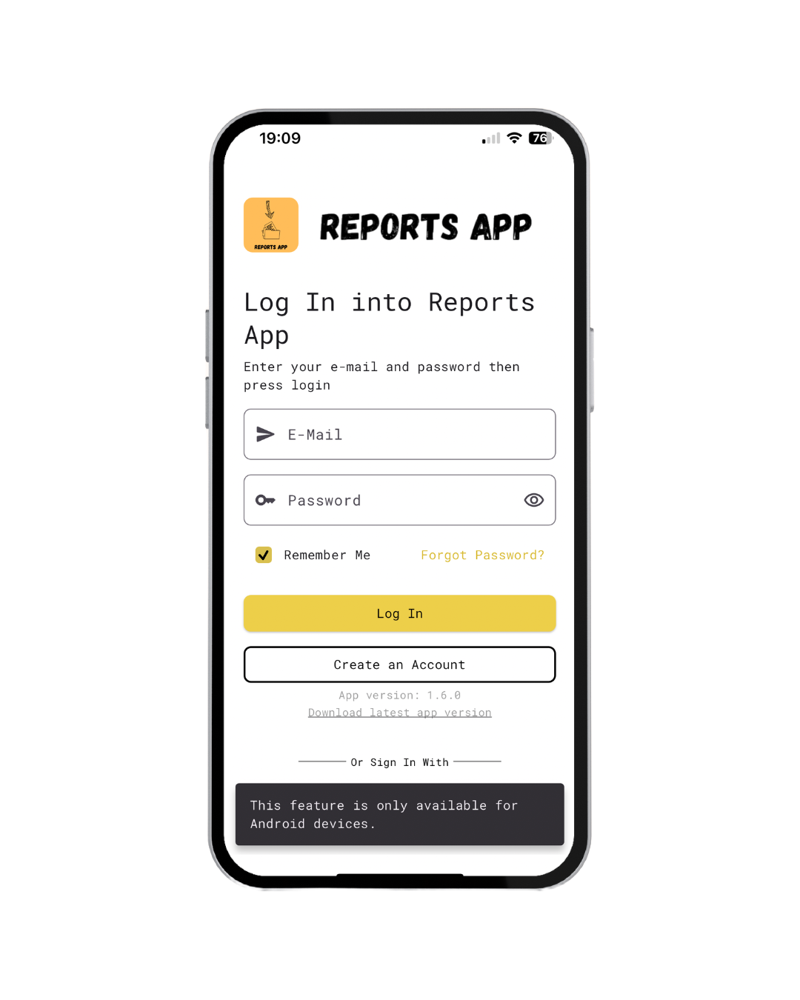

# How app_version_control.dart works

The application is not available on the App Store and Play Store so use ```app_version_control.dart``` to check the minimum version required to use the app and the latest version available.
The code checks a ```.json``` file saved on a private repo on GitHub structured like this:

```json
{
    "appMinimumRequiredVersion": "1.2.0",
    "latestVersionAvailable": "1.6.0",
    "latestVersionApkDownloadLink": "DOWNLOAD_LINK_HERE"
}
```

If the installed version is lower than the minimum version, the application closes on iOS while on Android it allows you to open the download link for the latest version in the browser.

```app_version_control.dart``` has a function that compares the current version with the latest available version (```checkAppVersion```) and another function (```downloadNewVersion```) that allows you to update the app to the latest version.

Obviously the application download is only available in ```.apk``` format for Android as on iOS it is not possible to install applications outside the App Store.

If you try to launch the download on an iPhone, a ```SnackBar``` displays a warning informing the user that the download is only available on Android devices.

<div style="display: flex; justify-content: center">
    
</div>